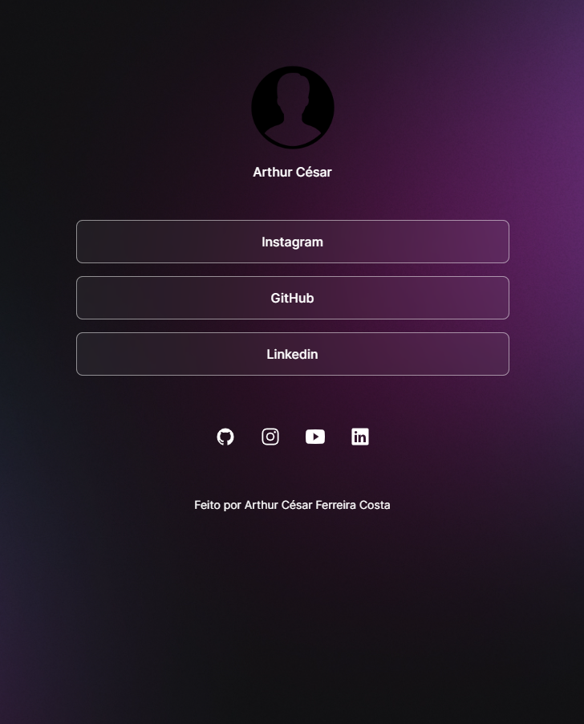

<h1 align="center"> DevLinks </h1>

<h1 align="center"> Projeto básico, promovido pela Rocketseat. </h1>

    <a 
    href="#-tecnologias">Tecnologias</a>&nbsp;&nbsp;&nbsp;|&nbsp;&nbsp;&nbsp;
    <a
    href="#-projeto">Projeto</a>&nbsp;&nbsp;&nbsp;|&nbsp;&nbsp;&nbsp; 
    <a 
    href="#memo-licença">Licença</a>

    

 

    

## 🚀 Tecnologias

Esse Projeto foi desenvolvido com as seguites tecnologias:

- HTML E CSS
- JavaScript
- Git e GitHub

## 💻 Projeto
O DevLinks é um agregador de links para usar como cartão de visitas online.

## 🪪 Licença

Esse projeto está sob a licença MIT.